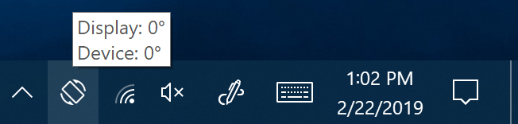

# Pivot Partner
Designed with Windows 10 tablets like the Surface Pro in mind, Pivot Partner is a small program that runs in the system tray to give you more control over when the display should rotate than just enabling or disabling Rotation Lock.

Best used with Rotation Lock enabled, Pivot Partner will monitor changes in the display's rotation and the device's physical orientation and, whenever the two differ, it will let you rotate the display to match the current orientation with just a click or tap.  This is a bit like Android 8.0's [Rotate Suggestions](https://source.android.com/devices/tech/display/rotate-suggestions) feature.

## Suggested Usage
* [Download the latest release](https://github.com/cszucko/PivotPartner/releases)
* Put `PivotPartner.exe` in your startup folder so it runs automatically
  * The startup folder can be found by navigating to `shell:startup` in explorer

## Building
Pivot Partner was compiled using Visual Studio 2017.

## FAQ
**Why is the tray icon gray and clicking/tapping won't rotate the screen?**

If the app cannot determine the current display or device orientation it will dim the icon and will not attempt to make any changes when tapped.  This is most commonly caused by the device being oriented too parallel to the ground for the orientation sensor to determine which way is up.

## Contributing
Contributions are welcome!  I don't routinely work with C# or write Windows applications so if there's a smarter way to do anything here or even if you just spot some egregious style issues that make your eye twitch feel free to open a pull request.

## Acknowledgments
Google
* Made the [Material Design Icons](https://github.com/google/material-design-icons) available under the Apache 2.0 license.  This app's tray icon is based on `screen_rotation`.
